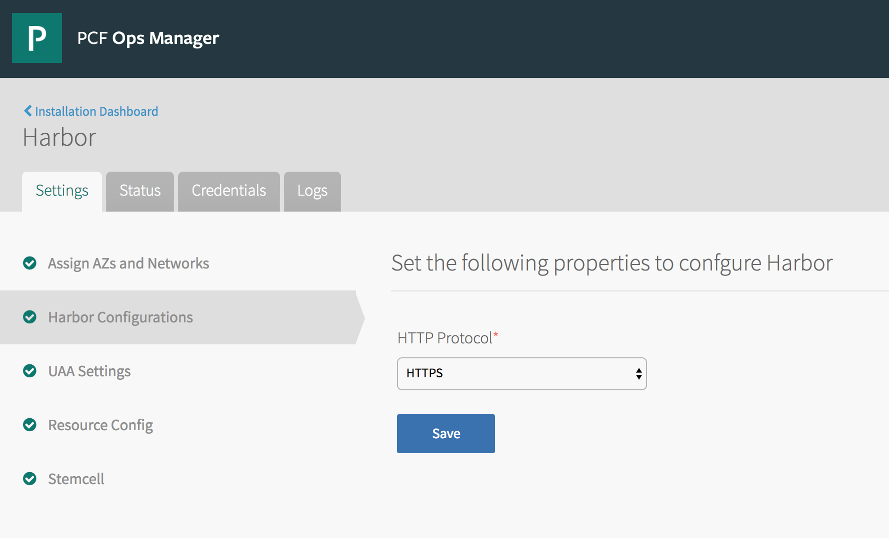

# harbor-tile
Project to build the tile for Harbor based on Harbor bosh release.

**NOTES: Tile for Harbor is still under development. It's very unstable and may be not usable some time.**

## Package
[Tile](https://docs.pivotal.io/tiledev/tile-structure.html) in this project is built based on the [Harbor](https://github.com/vmware/harbor) [bosh](https://bosh.io) [release](https://github.com/steven-zou/harbor-bosh-release) created before.

```
packages:
- name: harbor
  type: bosh-release
  path: resources/harbor-bosh-release_0.1.3+dev.01.tgz
```

## Setup DEV environment
### Tile Generator
Pivotal recommends using [virtualenv](https://virtualenv.pypa.io/en/stable/) to setup the development environment. Install the **tile-generator** in the virtual environment created by virtualenv.
```
//create env
virtualenv -p /usr/local/python tile-generator-env

//activate env
source tile-generator-env/bin/activate

//install tile-generator
pip install tile-generator
```

### Pivotal Ops Manager
If you want to build you own ops manager environment to validate the tile you build, you can follow the document below to deploy Ops Manager on vSphere (For other IaaS platform, please refer the Povital document).

* [Deploying Operations Manager to vSphere](http://docs.pivotal.io/pivotalcf/1-12/customizing/deploying-vm.html)
* [Configuring Ops Manager Director for VMware vSphere](http://docs.pivotal.io/pivotalcf/1-12/customizing/vsphere-config.html)

## Build and Test
Use the following command to initialize tile project if not create yet.
```
cd YOUR-PROD-DIRECTORY
tile init

```

Edit the generated **tile.yml** file to define your tile.
```
---
name: harbor-tile # By convention lowercase with dashes
icon_file: resources/harbor.png
label: Harbor
description: Project Harbor is an enterprise-class registry server that stores and distributes Docker images. Harbor extends the open source Docker Distribution by adding the functionalities usually required by an enterprise, such as security, identity and management.

packages:
- name: harbor
  type: bosh-release
  path: resources/harbor-bosh-release_0.1.3+dev.01.tgz
  jobs:
  - name: harbor-app
    templates:
    - name: harbor
      release: harbor-bosh-release
    cpu: 1
    memory: 4096
    ephemeral_disk: 10240
    persistent_disk: 20480
    instances: 1
    static_ip: 0
    dynamic_ip: 1
    default_internet_connected: false
    max_in_flight: 1
    properties:
      harbor:
        ui_url_protocol: (( .properties.ui_url_protocol.value ))

stemcell_criteria:
  os: ubuntu-trusty
  requires_cpi: false
  version: '3445.11' #Harbor BOSH release is built based on this version. Let's use it at present!

forms:
- name: harbor_properties
  label: Harbor Configurations
  description: Set the following properties to confgure Harbor
  properties:
  - name: ui_url_protocol
    type: dropdown_select
    label: HTTP Protocol
    description: The protocol for accessing the UI and token/notification service
    options:
    - name: http
      label: HTTP
      default: true
    - name: https
      label: HTTPS
- name: uaa_settings
  label: UAA Settings
  description: Set the UAA configurations as AUTH provider
  properties:
  - name: uaa_address
    type: string
    label: UAA Address
  - name: uaa_client_id
    type: string
    label: Client id
  - name: uaa_client_secret
    type: secret
    label: Client Secret

update:
  canaries: 1
  canary_watch_time: 10000-100000
  max_in_flight: 1
  update_watch_time: 10000-100000

```

Build the tile.
```

tile build [version]

```
The build command will generate the **product** folder which contains the deployable *.pivotal tile file and all the artifacts that tile required. A new product tile yaml file **[product name].yml** will also created under the **product/metadata/** based on the tile.yml you edited above. The related properties will be redefined by the generator.

**NOTES: The generated yml file may include some properties related with Pivotal Elastic Runtime (always start with ..cf). If your deployment is built on BOSH release, that means it does not depend on Pivotal Elastic Runtime, you can remove those properties. Otherwise, the deployment will be definitely failed.**

You can import the generated Harbor tile file which is located in the **product** folder into the ops manager to try the product deployment.


Configure the Harbor.


Check the status after a successfully deployment.


## Example
Here is a sample provided by Pivotal team for your reference.[sample](https://github.com/cf-platform-eng/tile-generator/tree/master/sample)